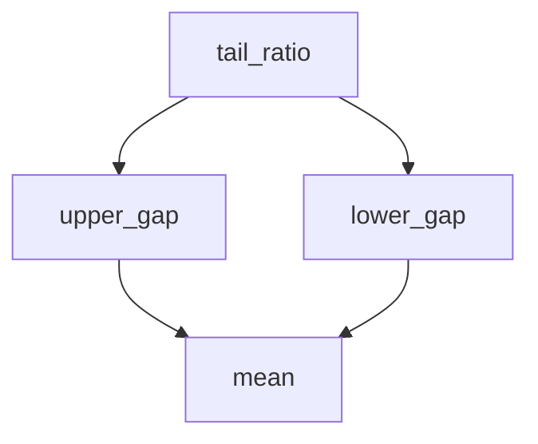

# Building a Configurable Calculator

This is the capstone. You have configured models, defined workflows, built an ETL pipeline, and composed it into a config-group application. Now you will combine the **functional `@Flow.model` API** with everything you know about Hydra to build a small "calculator" you drive entirely from the command line: read input operands, apply a calculation chosen from a registry of functions, and emit the result through a choice of outputs — every part swappable and configurable from YAML or the CLI. Along the way the functional dependency graph will do real work.

After this tutorial you should feel comfortable assembling your own system from these parts. Keep the [Flow Model](Flow-Model) reference open alongside this page for `@Flow.model` API details.

> [!NOTE]
> The full source is in-tree at [`ccflow/examples/calculator`](https://github.com/Point72/ccflow/tree/main/ccflow/examples/calculator), and runs with `python -m ccflow.examples.calculator`.

## Input vs. configuration

A calculator reads *input* (the operands) and applies a *configured* operation (add an offset, scale by a factor, raise to an exponent). The functional API makes that split explicit, and the split is what makes calculations interchangeable:

- **`FromContext[...]` parameters** are the runtime *input* — the operands, supplied per run.
- **Ordinary parameters** are the *configuration* — bound from YAML or the CLI, fixed for a run.

Get that split right and each calculation becomes a drop-in replacement for the others, selectable and configurable purely from Hydra.

## Writing the calculations

Instead of subclassing `CallableModel`, decorate plain functions with `@Flow.model`. Each declares a context type for its input and exposes its configuration as ordinary parameters:

```python
# ccflow/examples/calculator/functions.py
from ccflow import ContextBase, Flow, FromContext


class Numbers(ContextBase):
    """Runtime input for the calculators: the operands to compute on."""
    values: list[float] = []


@Flow.model(context_type=Numbers)
def add(values: FromContext[list[float]], offset: float = 0.0) -> float:
    """Sum the input values, then add a configurable offset."""
    return sum(values) + offset


@Flow.model(context_type=Numbers)
def scale(values: FromContext[list[float]], factor: float = 1.0) -> float:
    """Sum the input values, then multiply by a configurable factor."""
    return sum(values) * factor


@Flow.model(context_type=Numbers)
def power(values: FromContext[list[float]], exponent: float = 2.0) -> float:
    """Raise each input value to a configurable exponent and sum the results."""
    return sum(value**exponent for value in values)
```

Read one signature and the contract is obvious: `values` comes from the runtime context (marked `FromContext`), while `offset` / `factor` / `exponent` are bound configuration. `@Flow.model` turns each function into a real `CallableModel` — the same registry, evaluator, caching, and Hydra machinery you have used all along — and wraps the plain `float` return in a `GenericResult`.

> [!NOTE]
> Every `@Flow.model` with a `context_type` must have at least one `FromContext[...]` parameter; that is how the framework knows which inputs come from the context.

## Selecting a calculation from a config group

Make the calculations interchangeable from configuration. Each becomes an option in a `function` config group — a small YAML file that targets the function and sets its default configuration:

**config/function/add.yaml**

```yaml
_target_: ccflow.examples.calculator.functions.add
offset: 0.0
```

**config/function/scale.yaml**

```yaml
_target_: ccflow.examples.calculator.functions.scale
factor: 1.0
```

**config/function/power.yaml**

```yaml
_target_: ccflow.examples.calculator.functions.power
exponent: 2.0
```

Using a `@Flow.model` function as a Hydra `_target_` calls it with the given fields (`add(offset=0.0)`), building a configured model instance. The base config selects a default and dispatches to whatever ends up under the `function` key. We start small and grow this file as the tutorial goes:

**config/base.yaml**

```yaml
# @package _global_

defaults:
  - _self_
  - function: add

callable: /function
```

Selecting `function: add` places `config/function/add.yaml` under the `function` key; loading the config registers that model at `/function`; and `callable: /function` tells the runner what to execute — the same [dispatch pattern](Composing-an-ETL-Application#dispatching-which-callable-to-run) from the ETL application, now dispatching a functional model.

## Running it

The entry point is the familiar Hydra runner:

```python
# ccflow/examples/calculator/__main__.py
import hydra
from ccflow.utils.hydra import cfg_run


@hydra.main(config_path="config", config_name="base", version_base=None)
def main(cfg):
    cfg_run(cfg)
```

Run the default calculation, passing the operands as the context:

```bash
python -m ccflow.examples.calculator +context.values=[1,2,3]
#> [...][ccflow.utils.hydra][INFO] - {'value': 6.0, '_target_': 'ccflow.result.generic.GenericResult'}
```

`+context.values=[1,2,3]` provides the runtime input (`+` adds the `context` key); `add` sums it to `6` and applies its `offset` of `0`.

### Swap the calculation

Because `function` is a config group, name a different option by referencing the file using
the override grammar:

```bash
python -m ccflow.examples.calculator function=scale +context.values=[1,2,3]
#> {'value': 6.0, ...}
```

> [!NOTE]
> **`+` or no `+`?** `function` is already in the defaults list, so you *override* the selection with `function=scale` (no `+`). If the base did **not** default-select a function, you would *append* with `+function=scale`. Same idea for any config group.

### Configure the calculation

Override its fields with dotted paths — the input stays the same, the calculation changes:

```bash
python -m ccflow.examples.calculator function=scale function.factor=10 +context.values=[1,2,3]
#> {'value': 60.0, ...}

python -m ccflow.examples.calculator function=power function.exponent=3 +context.values=[1,2,3]
#> {'value': 36.0, ...}
```

`function.factor=10` reaches into the composed `function` subtree. That is the input/configuration split at work: `+context.values=...` changes *what* you compute on, `function.<field>=...` changes *how*.

## Composing calculations in YAML

A regular (non-`FromContext`) parameter can be fed by *another model*, letting you wire a graph in configuration. Add a `rounded` stage whose input is produced by an upstream calculation:

```python
@Flow.model
def rounded(value: float, digits: int = 2) -> float:
    """Round an upstream result to a configurable precision."""
    return round(value, digits)
```

**config/function/rounded.yaml**

```yaml
_target_: ccflow.examples.calculator.functions.rounded
digits: 2
value:
  _target_: ccflow.examples.calculator.functions.power
  exponent: 2.0
```

`value` is a regular parameter bound to a `power` model. When `rounded` runs, `@Flow.model` first evaluates `power` with the ambient context, then passes its result in:

```bash
python -m ccflow.examples.calculator function=rounded function.digits=1 +context.values=[1.5,2.5]
#> {'value': 8.5, ...}
```

`power` squares and sums `1.5` and `2.5` to `8.5`, and `rounded` rounds it — two functions composed entirely through YAML.

## Making the dependency graph do real work

That `rounded ← power` chain is linear, so a graph has nothing to optimize. The dependency graph earns its keep when a node is *reused*. Consider a `tail_ratio` — how far the largest value sits above the mean, relative to how far the smallest sits below. It needs `upper_gap` and `lower_gap`, and *both* need the `mean`:

```python
@Flow.model(context_type=Numbers)
def mean(values: FromContext[list[float]]) -> float:
    """Average of the input values."""
    return sum(values) / len(values)


@Flow.model(context_type=Numbers)
def upper_gap(values: FromContext[list[float]], center: float) -> float:
    """How far the largest value sits above `center` (typically the mean)."""
    return max(values) - center


@Flow.model(context_type=Numbers)
def lower_gap(values: FromContext[list[float]], center: float) -> float:
    """How far the smallest value sits below `center` (typically the mean)."""
    return center - min(values)


@Flow.model
def tail_ratio(upper: float, lower: float) -> float:
    """Ratio of the upper gap to the lower gap."""
    return upper / lower
```



That shared `mean` is a diamond. In YAML it is just nesting — `center` on each gap is fed by a `mean`:

**config/function/tail_ratio.yaml**

```yaml
_target_: ccflow.examples.calculator.functions.tail_ratio
upper:
  _target_: ccflow.examples.calculator.functions.upper_gap
  center:
    _target_: ccflow.examples.calculator.functions.mean
lower:
  _target_: ccflow.examples.calculator.functions.lower_gap
  center:
    _target_: ccflow.examples.calculator.functions.mean
```

You never wrote a `__deps__` method: with `@Flow.model`, wiring `mean` into each gap's `center` *is* the dependency declaration, and the decorator generates the `__deps__` that a class-based `CallableModel` declares by hand with `@Flow.deps` (as in [Defining Workflows](Defining-Workflows#evaluators-run-your-steps)). Because the graph is known, a [`GraphEvaluator`](Cache-Results#evaluate-a-dependency-graph) plus cache computes the shared `mean` **once** instead of once per branch. Instrument `mean` to watch it happen:

```python
from ccflow import Flow, FlowOptionsOverride, FromContext
from ccflow.evaluators import GraphEvaluator, MemoryCacheEvaluator, MultiEvaluator
from ccflow.examples.calculator.functions import Numbers, lower_gap, tail_ratio, upper_gap

calls = {"mean": 0}


@Flow.model(context_type=Numbers)
def counting_mean(values: FromContext[list[float]]) -> float:
    calls["mean"] += 1
    return sum(values) / len(values)


m = counting_mean()
model = tail_ratio(upper=upper_gap(center=m), lower=lower_gap(center=m))

model({"values": [1, 2, 3, 10]})
print("plain:", calls["mean"])
#> plain: 2

calls["mean"] = 0
evaluator = MultiEvaluator(evaluators=[GraphEvaluator(), MemoryCacheEvaluator()])
with FlowOptionsOverride(options={"cacheable": True, "evaluator": evaluator}):
    model({"values": [1, 2, 3, 10]})
print("graph + cache:", calls["mean"])
#> graph + cache: 1
```

Plain evaluation runs `mean` twice, once per branch; the graph evaluator runs it once. Turn this on for *every* run by adding a `cli.model` block to `base.yaml` — the [shared execution policy](Composing-an-ETL-Application#sharing-an-execution-policy) that `cfg_run` applies to whatever it dispatches:

```yaml
# added to config/base.yaml
cli:
  model:
    _target_: ccflow.FlowOptions
    evaluator:
      _target_: ccflow.evaluators.MultiEvaluator
      evaluators:
        - _target_: ccflow.evaluators.GraphEvaluator
        - _target_: ccflow.evaluators.MemoryCacheEvaluator
    cacheable: true
```

Now the diamond is deduplicated automatically:

```bash
python -m ccflow.examples.calculator function=tail_ratio +context.values=[1,2,3,10]
#> {'value': 2.0, ...}
```

For `[1, 2, 3, 10]` the mean is `4`: the top sits `6` above it and the bottom `3` below, so the ratio is `2.0`. This is where the functional API pays off — compose functions, and the wiring becomes a real dependency graph that a graph evaluator runs efficiently.

## Choosing how to emit the result

So far the runner just logs the result. Let's make *emission* swappable too, with a second config group, `output`, whose options decide how the result leaves the program: print it, log it, or write it to a file. Output is independent of the calculation, so it composes with any `function`.

Each option is a [`PublisherModel`](Bind-Logic-to-Configs#write-a-custom-publisher) — a `CallableModel` that runs an inner model and hands its result to a publisher. The inner model is the calculation registered at `/function`, referenced by name:

**config/output/print.yaml**

```yaml
_target_: ccflow.PublisherModel
model: /function
publisher:
  _target_: ccflow.publishers.PrintPublisher
field: value
```

**config/output/log.yaml**

```yaml
_target_: ccflow.PublisherModel
model: /function
publisher:
  _target_: ccflow.publishers.LogPublisher
  level: info
field: value
```

**config/output/write.yaml**

```yaml
_target_: ccflow.PublisherModel
model: /function
publisher:
  _target_: ccflow.publishers.GenericFilePublisher
  name: result
  suffix: .txt
field: value
```

`model: /function` is a registry reference — the [dependency injection](Configuring-Models#dependencies-and-dependency-injection) from earlier — so the output stage wraps whichever calculation is selected. `field: value` publishes the `value` field of the calculation's `GenericResult` (the bare number).

Add the `output` group to the defaults and dispatch through it. Here is the base config in full, exactly as the example ships:

**config/base.yaml**

```yaml
# @package _global_

defaults:
  - _self_
  - function: add
  - output: print

callable: /output

cli:
  model:
    _target_: ccflow.FlowOptions
    evaluator:
      _target_: ccflow.evaluators.MultiEvaluator
      evaluators:
        - _target_: ccflow.evaluators.GraphEvaluator
        - _target_: ccflow.evaluators.MemoryCacheEvaluator
    cacheable: true
```

`callable: /output` now runs the publisher, which calls the selected `/function` and emits its result. With `output: print` as the default, a run both prints the bare value and logs the result object. Vary the output while holding the calculation at the default `add`:

```bash
# Print (the default): the bare value on stdout, plus the runner's log line
python -m ccflow.examples.calculator +context.values=[1,2,3]
#> 6.0
#> [...][ccflow.utils.hydra][INFO] - {'value': 6.0, ...}

# Log through the ccflow logger instead:
python -m ccflow.examples.calculator output=log +context.values=[1,2,3]
#> [...][ccflow][INFO] - 6.0

# Write to a file (result.txt in the working directory):
python -m ccflow.examples.calculator output=write function=scale function.factor=10 +context.values=[1,2,3]
#> [...][ccflow.utils.hydra][INFO] - {'value': PosixPath('result.txt'), ...}
```

```bash
$ cat result.txt
60.0
```

The calculator now has two independent dials: `function=<name>` picks *what* to compute and `output=<name>` picks *how to emit it*, and either is reconfigurable (`function.factor=10`, or a file publisher's `output.publisher.suffix=.csv`) without touching the other — a small matrix of choices, all from YAML and the command line.

## Using it interactively

The same configuration is available as live objects for research. Load it into the registry and run it from Python, applying the overrides you would pass on the CLI:

```python
from ccflow import ModelRegistry
from ccflow.examples.calculator import load_config

registry = load_config(overrides=["function=power", "function.exponent=3"])
model = registry["/function"]
print(model.exponent)
#> 3.0
print(model({"values": [1, 2, 3]}).value)
#> 36.0
ModelRegistry.root().clear()
```

The selected calculation is a normal model at `/function`; its configuration is just attributes (`model.exponent`), and you run it by calling it with the input context.

## Inspecting the configuration

The explain entry point shows exactly what Hydra composed, including which config-group options exist and which was selected:

```bash
python -m ccflow.examples.calculator.explain function=power --no-gui
```

## What you built — and what's next

You built a command-line calculator where:

- calculations are plain functions promoted to models with `@Flow.model`,
- the input/configuration split falls out of `FromContext[...]` vs. ordinary parameters,
- calculations are an interchangeable config group, selected with `function=<name>` and configured with `function.<field>=<value>`,
- calculations compose into a dependency graph in YAML, and reused nodes (the shared `mean` in `tail_ratio`) are evaluated once under the graph evaluator,
- emission is a second, independent config group (`output=print` / `log` / `write`) built from publishers,
- and the whole thing runs from the CLI or interactively from Python.

That is the combined flexibility of `ccflow` + Hydra in one small program: a registry of functions, per-function configuration, a real dependency graph, and CLI dispatch, all driven from flexible YAML.

You now have every piece to build your own system — configuration ([Configuring Models](Configuring-Models)), workflows ([Defining Workflows](Defining-Workflows)), pipelines ([Building an ETL Pipeline](Building-an-ETL-Pipeline)), config-group composition ([Composing an ETL Application](Composing-an-ETL-Application)), and functional dispatch (this tutorial). Go build one.

- [Flow Model](Flow-Model) — the complete `@Flow.model` reference, including `Dependency[...]`, `.flow.with_context(...)`, and context transforms.
- [Configuration and Hydra](Configuration-and-Hydra) — the reasoning behind config groups and dispatch.
- [How-to Guides](How-to-Guides) — recipes for caching, retries, and richer configuration as your system grows.
